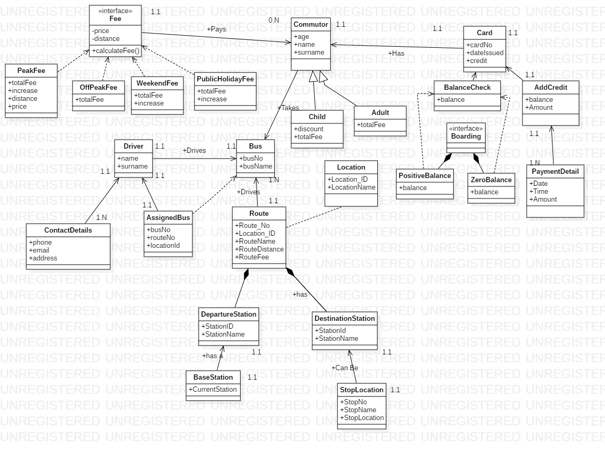

##Domain: 
Public Bus Transportation System

##Problem solution: 
The public transportation system would require users to a have a card that would enable them to enter the bus. The user’s information would be captured on the system so that we can keep track of the user’s data for example the distances they travel and also the available credit they have. If a user has insufficient funds, they would not be able to board the bus. 

##Solution:
I would like to create an application that would calculate the balance of a user based on their distances travelled and available credit. The application would also determine whether they can board a bus again or if they should load credit.
 

